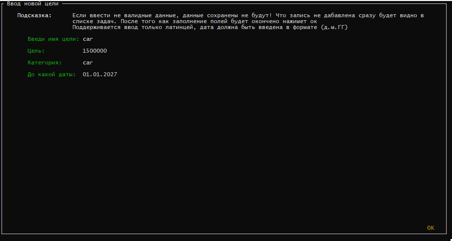

# piggy-bank

1. Зпустить приложение на windows можно срзау чрезе ```app_runer.bat```<br>
2. Приложение имеет вид навигация по виджетам осуществляется мышью либо клавишей \<tab> выбор целей осуществляется клавишей \<space> на навигация по пунктам меню осуществляется клавишами \<up> \<down><br>
После выбора цели в меню целей подргужается иноформация в окно \<Подробнее о цели>
<br>
>ps Пунтк Прогресс по цели указывает процентное соотношение завершенных целей к не завершонным
3. Для добалвения новой цели необходимо нажать кнопку \<c> после чего осуществится переключению на форму ввода цели.
>форма ввода цели<br>
>

После окончания заполнения полей необходимо нажать кнопку \<ok> что вернет обратно к первоночальной форме<br>

4. Для обновления имеющихся денежных средств в копилке необходимо нажать клавишу <z> 
>Окно редактирования денежных средств
>

Ввод осущетсвляется цифрами раздилитель дробной части = ".". Если оставить поле ввода пустым либо допустить ошибку при вводе, например ввести не валидные значение, данные сохранены не будут. 
